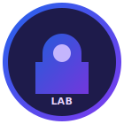
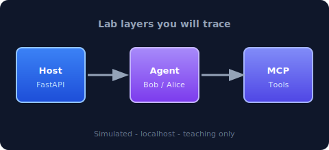

<div align="center">


<br/>

[](https://www.python.org/)
[](https://fastapi.tiangolo.com/)
[](https://modelcontextprotocol.io/)
[](https://owasp.org/)

<br/>


&nbsp;&nbsp;&nbsp;


</div>

---

## MCP security Lab – MCP Goat

### OWASP MCP / LLM Security Lab (local-only)

Educational, **intentionally vulnerable** Model Context Protocol (MCP) lab for students and AppSec / AI security practitioners. Everything runs locally with **dummy data** and a **simulated agent** (no cloud LLM required).

<div align="center">



*Trace tool selection, arguments, and outputs across **host → agent → MCP** layers.*

</div>

---

## What is inside

| Path | Description |
|------|-------------|
| [`vulnerable-app/`](vulnerable-app/) | FastAPI web UI, MCP-style tool handlers, SQLite fixtures, FastMCP stdio entrypoint |
| [`solution-guide/`](solution-guide/) | Mitigations, secure snippets, detection ideas, instructor notes, worksheet answers |
| [`INSTRUCTOR_GUIDE.md`](INSTRUCTOR_GUIDE.md) | Plain-language intro for teaching (repo root) |
| [`owasp-mapping.md`](owasp-mapping.md) | Dual mapping to OWASP MCP Top 10 + OWASP LLM Top 10 (2025) (repo root) |

**There are no solutions inside the vulnerable application.** Fixes and answers live only under `solution-guide/`.

---

## Safety

- Localhost use only; do not expose the container to untrusted networks.
- No real credentials, production APIs, or customer data.
- “Execution” and “HTML” risks are **simulated / sandboxed patterns** for teaching.

---

## Requirements

- Python **3.10+** (Docker image uses 3.12).
- Dependencies are listed in [`vulnerable-app/requirements.txt`](vulnerable-app/requirements.txt).

---

## Quick start (virtualenv)

```bash
cd vulnerable-app
python3.12 -m venv .venv
source .venv/bin/activate
pip install -r requirements.txt
export PYTHONPATH=.
uvicorn main:app --reload --host 127.0.0.1 --port 8080
```

Open `http://127.0.0.1:8080`, pick a lab, toggle **Bob** for authorization labs, and use **Instructor mode** for extra hints (never full solutions).

---

## Docker

```bash
docker compose up --build
```

Browse `http://127.0.0.1:8080`.

---

## Optional MCP stdio client

From `vulnerable-app` with `PYTHONPATH=.`:

```bash
python -m mcp_server.server
```

Connect only trusted local MCP clients. Default persona is Alice.

---

## Learning outcomes

After completing the labs, learners can:

- Map MCP failures to **OWASP MCP Top 10** and **OWASP LLM Top 10 (2025)**.
- Trace tool selection, arguments, and outputs across host, agent, and UI layers.
- Propose **detect** and **prevent** controls using the solution guide.

---

## Contributing

Issues and PRs should keep the **separation** between `vulnerable-app/` (attacks only) and `solution-guide/` (defenses). Avoid introducing real secrets or external service dependencies.

---

## References

- [OWASP Top 10 for LLM Applications 2025](https://genai.owasp.org/resource/owasp-top-10-for-llm-applications-2025)
- [OWASP MCP Top 10](https://owasp.org/www-project-mcp-top-10/)

---

<div align="center">

<sub>Made by Vandana Verma · palette: indigo, violet, and OWASP red accents</sub>

</div>
